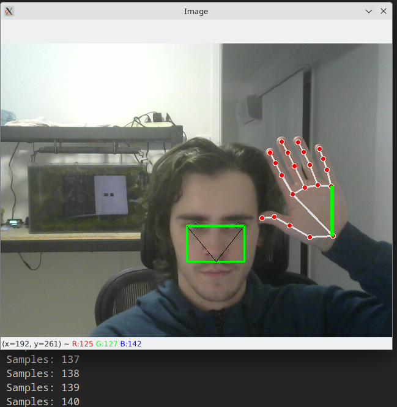
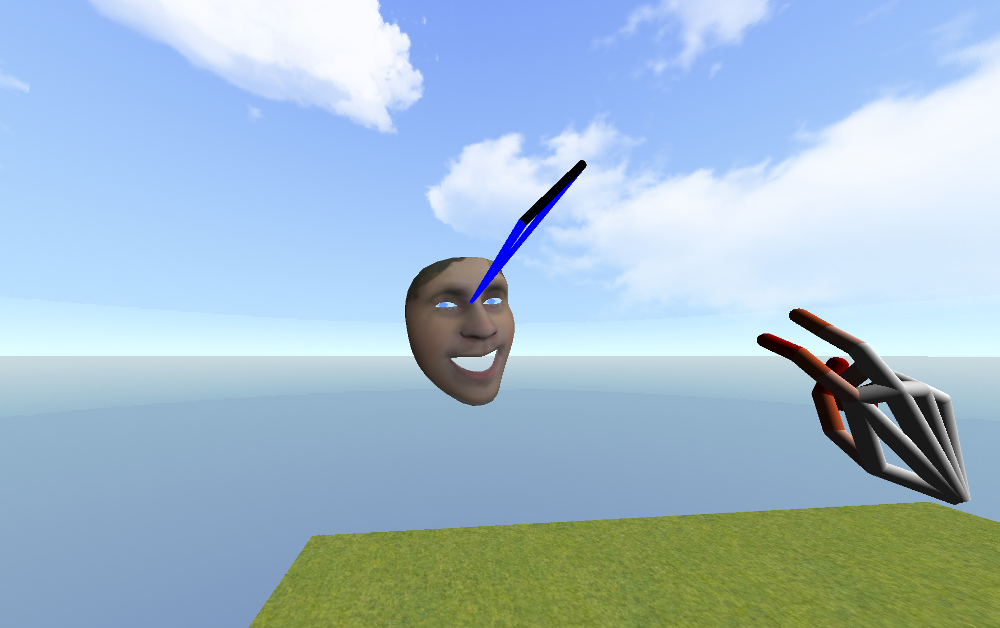

# Monocular Depth Estimation Demo


### Dependencies
All dependencies are listed in `requirements.txt` and can be installed through pip. It is recommended (but not required) that you use a virtual environment for this.
```    
$ pip3 install -r requirements.txt
```


### Calibration


The main program will refuse to start before the calibration program has run. This is necessary as the proportions of the users hands and face need to be known for accurate depth estimation.

Run `calibrate.py` from the root directory of the project. The program will first prompt for the real-world distance between hand landmarks 0 and 17. It will then request the expected real-world distance between the camera and the users face to be used during calibration.


```
$ python3 src/calibrate.py
```

A window will open displaying the video feed from the webcam. Apply roll and yaw to the face to align the red/blue bars on the screen until they turn green. Do the same with either (and only one) hand, held next to the face such that the palm is facing the camera/screen. Each time the bars turn green the information is stored to create an average. A message will be printed to the terminal each time stating how many samples have been collected. One sample is likely sufficient but averaging many helps reduce error.

Once enough samples have collected press either space or escape to save the data and exit the program. The information will be stored in `config/measurements.ini` to be read by the main program.




These only need to be rough measurements. For example, supplying a seating-depth of 1000mm but performing the calibration at 700mm is fine. The calibration program measures *proportions*, not absolute measurements.


### Demo Program
Run the main program
```
$ python3 src/main.py
```

#### Keyboard Controls:
- W A S D for camera translation.
- Q E for camera yaw.
- R F for camera pitch.


#### Computer-Vision Based Controls:
- Make a fist gesture and pull/push to drag the camera forwards/backwards through the scene.
- Head rotation will rotate the camera. Rotating beyond a certain threshold will change the default "front" direction of the camera so full 360 rotation is possible.


#### Controls Configuration:
- The config file for face controls are located in `config/fController.ini`.
- The file path for the face texture is found in `config/fRenderer.ini`. This can be swapped out for other textures.

- Pressing F5 will reload the configuration files without needing to restart the program.



